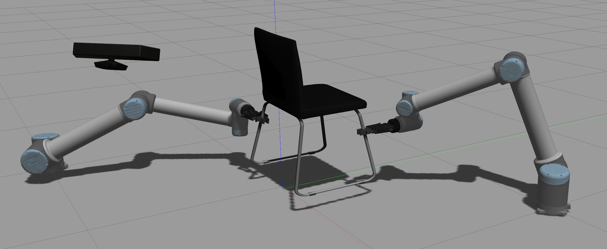
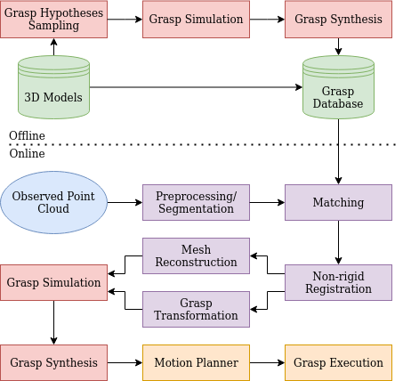
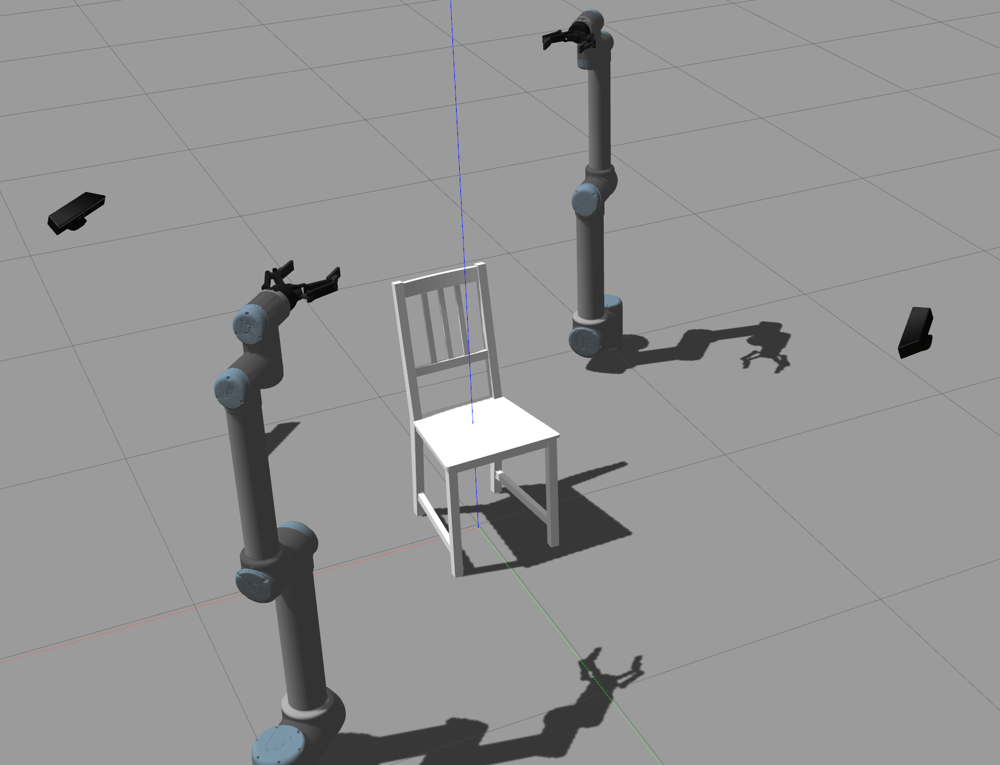

# Dual-Arm Grasping of Chairs

The goal of this project is to detect grasps for dual-arm manipulation of chairs.
In addition, we have done our best to provide a simulation in Gazebo to see the algorithms in action.

## Overview

The project contains two methods for grasp detection which are contained in the *chair_manipulation_grasp_detection_simple* and *chair_manipulation_grasp_detction_advanced* packages.
The first one is rather simple and restricted using basic OpenCV image processing.
It was only used to get going quickly and was then replaced by a rather advanced method.
The simple setup has some problems which is why we only show how to run the newer version.
Both algorithms output the tf frame for the grasp poses, named **robot1_grasp** and **robot2_grasp**.
These are then taken as input by the grasp planner contained in the *chair_manipulation_grasp_planner* package that plans and executes the grasps using Moveit!.
The *chair_manipulation_gazebo* package contains launch files to run the simulation.

## Installation

As a prerequisite, you must have ROS melodic installed on a Ubuntu 18 machine.

First, we have to install the fgt library system wide which we build from source.

    $ cd ~
    $ git clone https://github.com/gadomski/fgt
    $ cd fgt
    $ mkdir build
    $ cd build
    $ cmake ..
    $ sudo make install

Now, we install a compiler cache to decrease the compile time.

    $ sudo apt-get install ccache
    $ echo 'export PATH=/usr/lib/ccache:$PATH' >> $HOME/.bashrc
    $ source $HOME/.bashrc 

Furthermore, we need to install the following tools.

    $ sudo apt install python-wstool python-catkin-tools python-rosdep

Next, we setup the workspace for the project.

    $ cd ~
    $ mkdir chair_manipulation_ws
    $ cd chair_manipulation_ws
    $ mkdir src
    $ catkin init --workspace .
    $ git clone --recurse-submodules https://github.com/robmosys-tum/PapPercComp  src
    $ wstool init src
    $ wstool merge -t src src/PapPercComp/chair_manipulation/dependencies.rosinstall
    $ wstool update -t src
    $ rosdep install -y --from-paths src --ignore-src --rosdistro ${ROS_DISTRO}
    $ catkin config --cmake-args -DCMAKE_BUILD_TYPE=Release 
    $ catkin build

## Usage

1. First of all, the advanced algorithm requires you to first create the grasp database.

        $ roslaunch chair_manipulation_grasp_detection_advanced create_grasp_database.launch

2. We now launch the scene in Gazebo.

        $ roslaunch chair_manipulation_gazebo scene_bringup_advanced.launch

    Again, you can change the chair by specifying the **world_id** argument:

        $ roslaunch chair_manipulation_gazebo scene_bringup_simple.launch world_id:=2

3. Now, go inside Gazebo and press the play button.

4. Next, we launch moveit which is the framework that handles motion planning.

        $ roslaunch chair_manipulation_gazebo moveit_bringup.launch

5. Now, we start the node that will lift the chair.

        $ roslaunch chair_manipulation_gazebo lift.launch

    Wait until it says "Preparing".
    This will now wait for the reconstructed mesh of the chair and the grasp tfs.

6. Finally, launch the detection algorithm.

        $ roslaunch chair_manipulation_gazebo detection_advanced.launch

## FAQ

Q: The catkin build fails with the message

    c++: internal compiler error: Killed (program cc1plus)

A: This happened to us in a Ubuntu 18 virtual machine. Just run the build again and don't worry.

Q: When launching scene_bringup_simple.launch or scene_bringup_advanced.launch Gazebo does not start and I get red error messages in the output.

A: As said earlier, for some reason the tools sometimes kind of conflict with each other and doesn't launch. 
Just hit Ctrl+C and launch it again. If this doesn't work three times in a row, then some dependencies are missing.
Please make sure that you strictly followed the installation steps.

Q: The robot makes strange acrobatic movements to approach the grasping position.

A: This is due to the nature of search-tree-based motion planners that are used here.

Q: The robot completely freaks out (slides along the ground or collides with the chair) when executing the grasp and lift phases.

A: Unfortunately, the planner does not consider singular configurations which can lead to such catastrophical behaviors. 
In general, a more sophisticated planner for dual-arm execution would be required. 
Moveit! is actually not designed for multi-arm motion planning (for example, there do not exist constraints to synchronize the motion of multiple arms).

Q: The lift node fails with the message: "Solution found but controller fails during execution."

A: This happens if the motion planner executes a plan where the arms do not move up synchronously.
As said, there does not exist any constraints that tell Moveit! to do so.
Sometimes, this error also seems to occur during the grasp step.
A possible explanation could be that one of the arms is in a singular configuration.
Again, in order to solve these problem, a custom dual-arm motion planner would be required.

Q: The gripper slips through the chair.

A: Unfortunately, Gazebo is not optimized for grasping and therefore, slippage is a common issue.
To tackle this problem, we are using a grasping plugin which helps in some sense but is still far from being perfect.